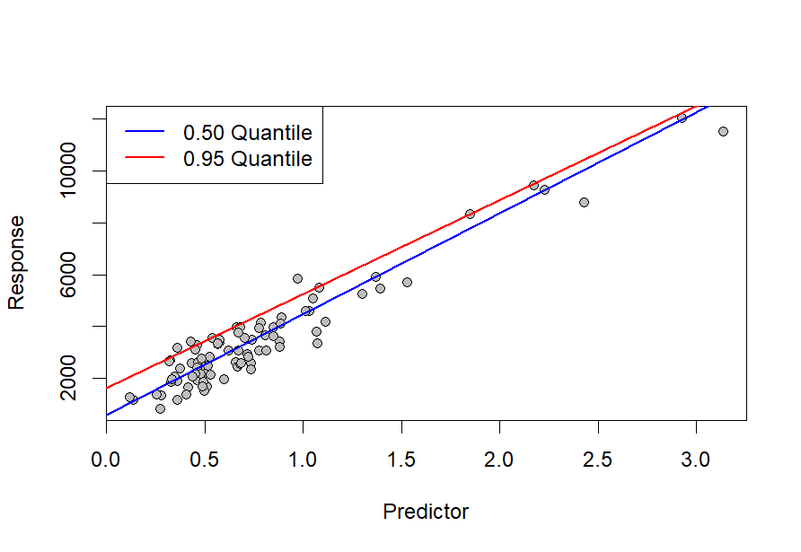

# Bayesian Quantile Regression

Implementation of Bayesian Quantile Regression (BQR) with the use of Stan and R programming languages for a single predictor variable, i.e.,  ***y** = b + w****x*** + ε. In constrast to tradition Linear Regression which estimates the conditional mean function, i.e., *E[**y**|**x**]*, BQR can be used to estimate any conditional quantile function of the form *qp(**y**|**x**)*, with *p* being the desired percentile. Bayesian inference is possible via the Asymmetric Laplace density function (see Yun & Moyeed, 2001). The **BQR.stan** script contains the Bayesian model can be easily modified to accommodate multiple predictors, while the **quantileRegression.R** script fits a quantile regression with a numerical optimization alogirthm as well as MCMC for a simple data set provided in **data-example.csv**.

  

**Reference**

1. Yu, K. and Moyeed, R.A., 2001. Bayesian quantile regression. *Statistics & Probability Letters, 54*(4), pp.437-447.
